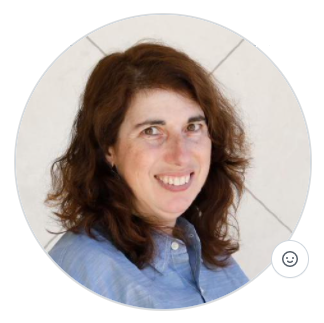

# Laura Novich 

Technical Documentation and Community Manager   
[ITCQF](https://itcqf.org) Certified  
Contact me at lsnovich@gmail.com    

# Summary

* 20+ years of experience documenting everything from quick start guides to APIs.   
* Open Source, Linux, and Git are my tools of the trade.   
* I work in a Docs as Code Philosophy and teach what I know to anyone willing to listen.   
* My experience includes template and style guide design, user-stories, and team management.    
* I quickly research and learn new technology.  I am a professional and proficient writer with a flair for desktop publishing and page design.  

I create and understand complex architecture diagrams and have experience in communication, security, authentication protocols, virtualization, etc. 

Tool Chest includes:
* Madcap Flare
* Jira/Confluence
* Git/TFS
* XML/DITA and DocBook
* FrameMaker
* MS Office Suite
* Visio, CorelDraw and More!

Trainer and Instructional Designer
Certified RHCSA - Red Hat Certified System Administrator

# Experience

## Zoomin Software  
*Technical Communication Manager*  
**Dates Employed**: Nov 2021 &ndash; Present  

Responisbilities include:
* Adminstration of the Zoomin Documetnation Portal (users and content management)
* Manage technical writing team
* Documentation Roadmaps, procedures, workflows, styleguides, and tooling
* Assign taks, mentor, and assist writers on the team
* Templates and training for the product team
* Doubled the number of topics in a year
* Ungated the portal opening content to all

## ScyllaDB   
*Documentation Community Manager*   
**Dates Employed**: Feb 2018 &ndash; Oct 2021  

Responisbilities include:
* Write maintain, and edit all documentation 
* Migrate content to reside in the same repo as code ("docs as code")
* Maintain web content and review contributions from developers
* Manage outsourced freelancers and projects
* Toolchest includes: GitHub, Sphinx, Restructured Text, CQL, AWS, GCE, all on Fedora

Where to find my work? 
* [Scylla Docs](https://docs.scylladb.com)
* [My Git Profile](https://github.com/lauranovich)
* [Interview](https://www.scylladb.com/2019/06/13/whats-hot-in-scylla-docs/)

## Verint CES (Customer Engagement Systems)  
*Senior Technical Writer*    
**Dates Employed**: Feb 2016 &ndash; Jan 2018  

Responsibilities included:
* Responsible for enterprise level security documentation and desktop and process analytics documentation. 
* Work with developers, system architects, support, field engineers, UX team, QA, etc. to align customer requirements, features, and documentation needs.
* Skilled in Agile / Scrum development environments. 

## Red Hat (KVM Team)  
Content Engineer  
**Dates Employed**: Dec 2011 &ndash; Jan 2016  

Responsibilities included:
* Content Engineer and team leader for RHEL platform Virtualization Documentation
* Project Management and assignment of tasks to the writing team
* Strategic planning of documentation requirements for present and future releases
* Writer of technical whitepapers and joint projects with strategic Red Hat partners
* Provide documentation for Open Source upstream projects such as Fedora
* Package Maintainer for Fedora KVM Docs
* RHCSA - Red Hat Certified System Administrator
* Present at technical confrences

Where to find my work?
* [Open Source Magazine](https://opensource.com/users/lnovich)
* [Fedora](https://fedoraproject.org/wiki/User:Lnovich)
* [Red Hat](https://access.redhat.com/documentation/en-us/red_hat_enterprise_linux/7/html/virtualization_getting_started_guide/index)
